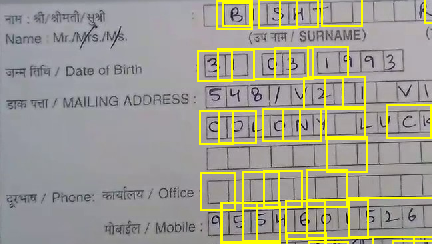
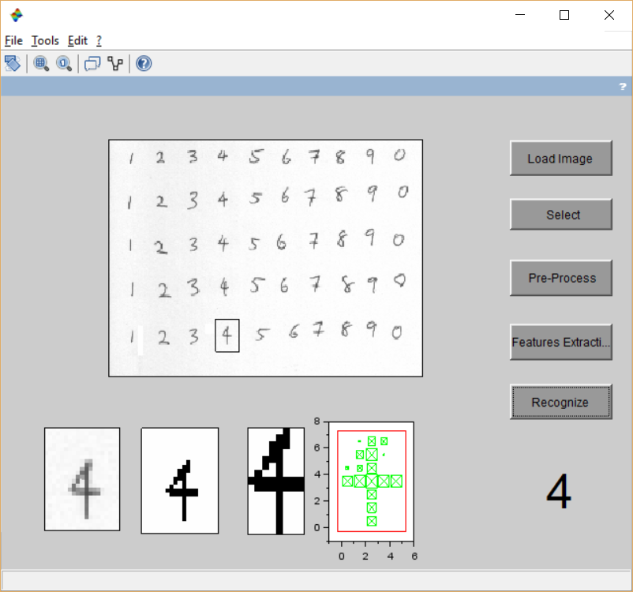

# Project Deep Blue OCR 05

The feature detector threshold is being adjusted to detect the bounding regions
for block letters. 

>MSER feature detection is being employed using `MATLAB`

## Input Image

## Output Image

>A `neural networks` based implementation is being explored alongside as alternative
model in `SCILAB`

