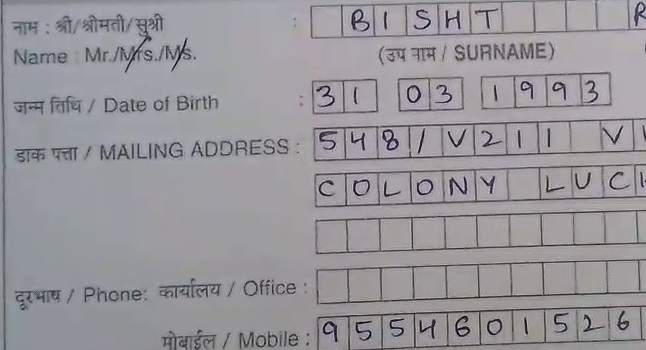
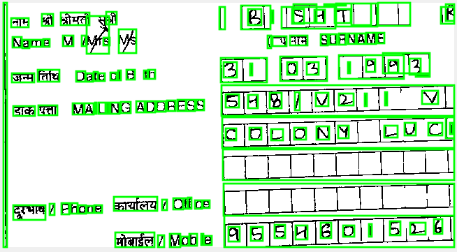
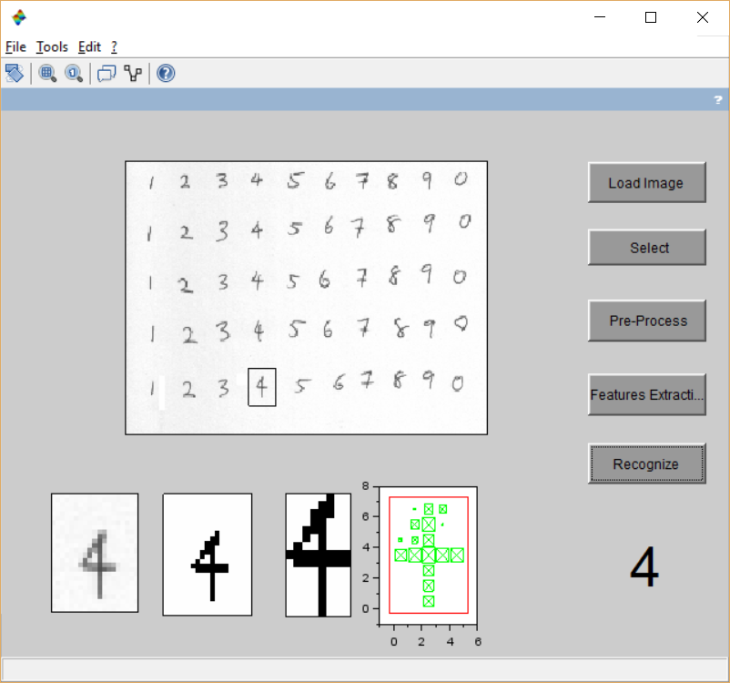

# Project Deep Blue OCR 05

>Feature detection is being employed using `MATLAB`

## Input Image

## Output Image

>A `neural networks` based implementation is being explored alongside as alternative
model in `SCILAB`

